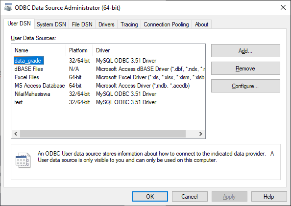
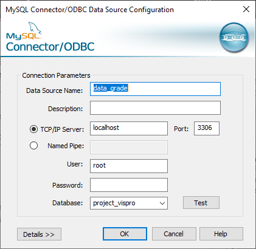
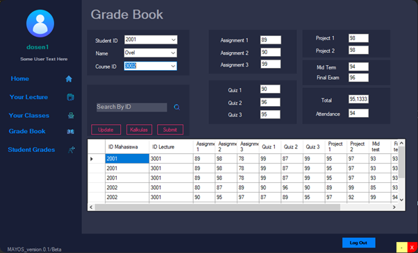
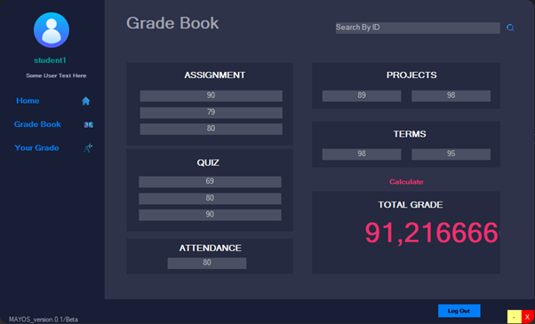
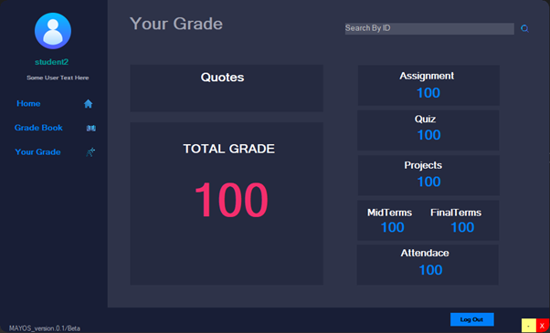
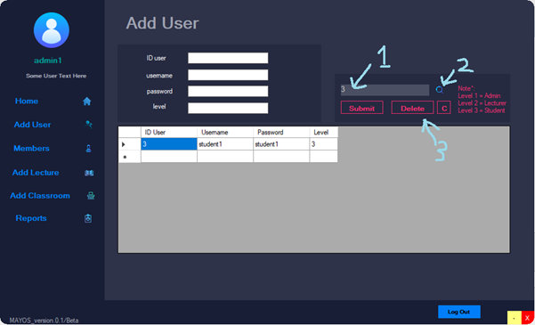
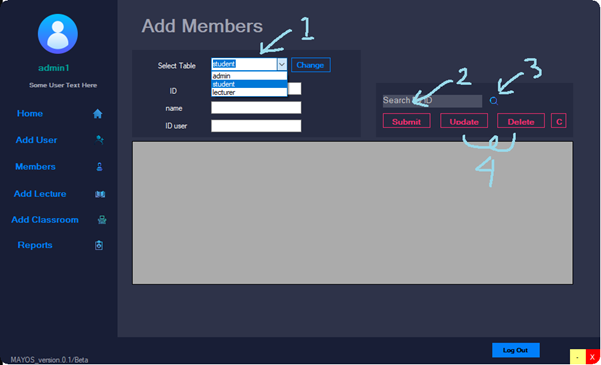
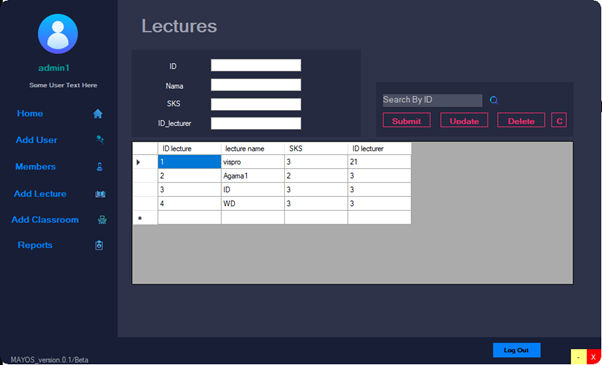
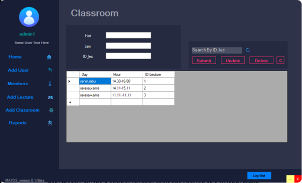

# MayOS

## Grading System

Group Project 3 of Visual Programming course using C# language

### Tutorial

**Short Tutor Some very important specific features in the MayOs App**

- ODBC name = data_grade

  Server type = MySQL ODBC 3.51 Driver

  Database name = project_vispro

  
  

- Input grade in grade book (lecturer user)

  

  - **_Submit :_** Make sure all fields are inputted. If there is no value, just put a value of 0.
  - **_Kalkulasi :_** All assignment, quiz, project, mid, final, and attendance columns must be inputted before calculating the total score.
  - **_Search :_** Enter the student ID and click search then the student data will be displayed.
  - **_Update :_** Search first for student data using the search method above, then we fill in the new data (make sure to fill in all fields completely) then click update.

- Input grade in grade book (student user)

  

  Unlike the lecturer's grade book, students can only calculate to predict the grade they will get. Remember, make sure all the fields are inputted with the grade before doing the calculation. If there is no grade, just put 0

- Your Grade

  

  Make sure to input a valid or registered student id and then search. If it is wrong, the program will close.

- Add User

  

  **_Delete :_** First, search the data using the user ID then click search. Then we can input new data and then click update.

- Members, add Lectures, dan add Classroom

  

  **_Update and Delete :_** First, select the table, then input the id in the search field then click search, we can delete the data or we input new data then click update to change the existing data.

  
  

  - **_Delete and Update :_** The same as the instructions above, except that here we don't need to select a table. Just search for the lesson ID then delete or input a new value then update.
  - **_C :_** Refresh datagrid
